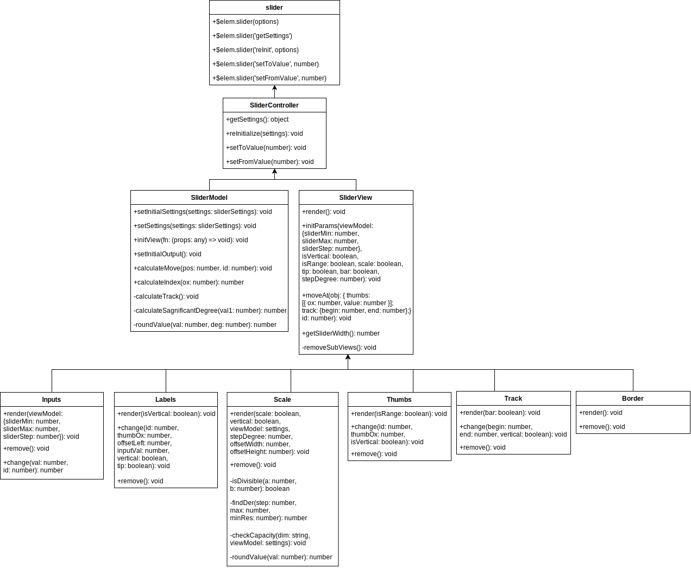

# Range Slider
Четвертый этап - практическое задание MetaLamp.  
Реализация плагина слайдера — специального контрола, который позволяет перетягиванием задавать какое-то числовое значение.

## Основные команды
`npm run dev` - сборка проекта в режиме development  
`npm run build` - сборка проекта в режиме production  
`npm start` - сборка проекта в режиме development, запуск локального сервера, открытие вкладки с адресом локального сервера в браузере  
`npm test` - запуск тестов jest  

## Использование
```javascript
import './range-slider.js';
import './range-slider.css';

$('#el').slider(options);
```

## Архитектура  
* Основной модуль - функция customSliderOuter реализует интерфейс взаимодействия с модулем SliderController.
* Модуль SliderController отвечает за взаимодействие с пользователем и модулями SliderModel и SliderView.
* Модуль SliderModel отвечает за бизнес-логику слайдера.  
Он принимает начальные установки.  
При перерасчете принимает значение в пикселях при перемещении ручки пользователем или конкретные значение при установке положения ручки из JavaScript.  
В нем формируется объект outputOx, содержащий:
    * для каждой ручки положение в процентах и текущее значение;
    * начало и конец прогресс бара в процентах.
* Модуль SliderView отвечает за отображение элементов слайдера.  
При начальной установке и реинициализации он отрисовывает каждый элемент слайдера.    
При принятии объекта outputOx меняются (но не перерисовываются полностью) элементы шкалы, лэйблов и ручек. Также меняется скрытый элемент input.  
В модуле SliderView импортируются subViews: inputs (скрытые input'ы), labels (значения над ручками), scale (шкала), thumbs (ручки), track (прогресс бар), border (граница).

## Событие слайдера  
`moveThumbEvent` - срабатывает при перемещении ручки и, соответственно, изменений значения. Второй аргумент функции-коллбэка содержит объект в котором:
   - id - обозначение ручки. 0 - меньшая ручка "от", 1 - большая ручка "до"  
   - inputVal - значение ручки

Пример использования
```javascript
function fromAndToValuesHandler(event, { inputVal, id }) {
    // id === 0 - значение "from", id === 1 - значение "to"
    console.log(`id - ${id}`);
    console.log(`значение - ${inputVal}`);
}
$sliderWrapper.on('moveThumbEvent', fromAndToValuesHandler.bind(this));
```

## API слайдера  
-  `$('#el').slider(options)` - при первичной инициализации слайдера.  
    - Первый аргумент - объект настроек:  
        - `range: boolean` - слайдер в виде диапазона с двумя ручками  
        - `vertical: boolean` - вертикальный вариант слайдера  
        - `scale: boolean` - добавление шкалы  
        - `tip: boolean` - добавление элемента с текущим значением над ручкой  
        - `bar: boolean` - добавление прогресс бара  
        - `min: number` - минимальное значение  
        - `max: number` - максимальное значение  
        - `step: number` - шаг  
        - `from: number` - значение "от" (только при range - true)  
        - `to: number` - значение "до"  
        <br>
    ```javascript
    $('#el').slider({
        range: true,
        vertical: false,
        scale: true,
        tip: true,
        bar: true,
        min: 0,
        max: 100,
        step: 10,
        from: 20,
        to: 40,
    });
    ```

- `reInit` - при реинициализации с аналогичным аргументом объектом настроек  

   ```javascript
   rangeSlider.slider('reInit', {
       range: false,
       vertical: true
   });
   ```

- `getSettings` - получение текущих настроек слайдера  

   ```javascript
   const settings = $rangeSlider.slider('getSettings');
   ```

- `setFromValue` - установка значения "от" (только при range - true)   

   ```javascript
   $rangeSlider.slider('setFromValue', 10)
   ```

- `setToValue` - установка значения "до"  

   ```javascript
   $rangeSlider.slider('setToValue', 20)
   ```
   

## Диаграмма

